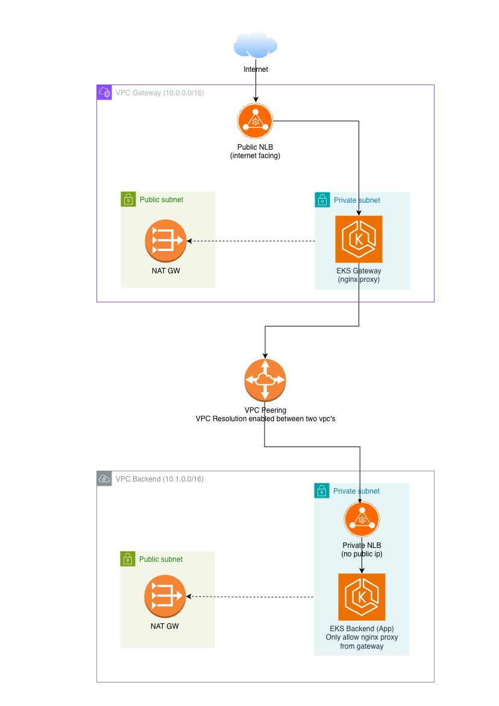
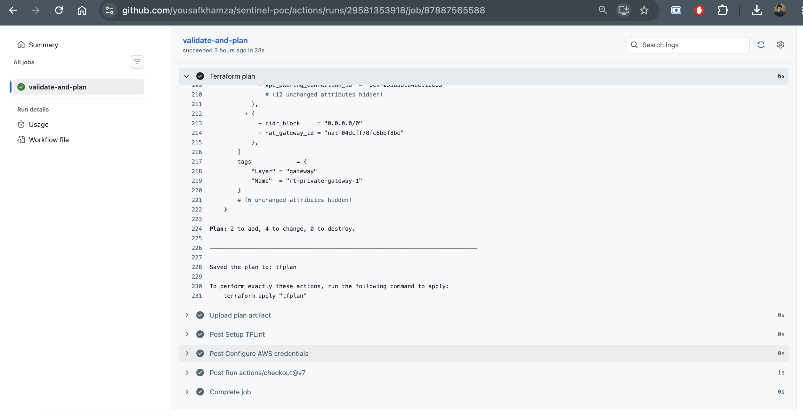
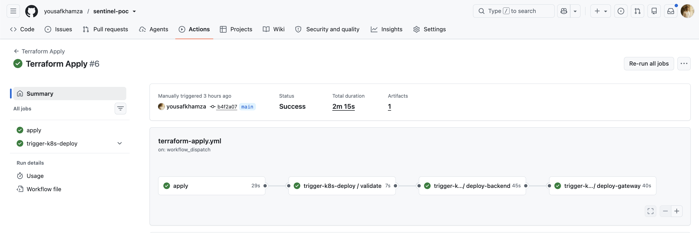
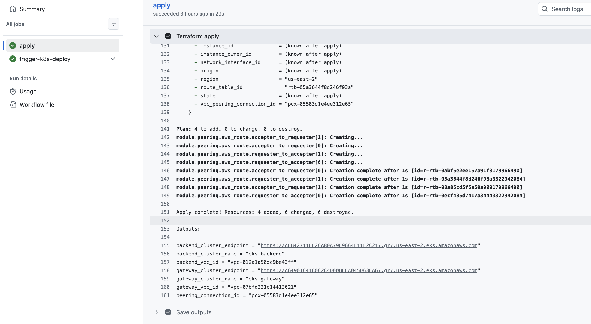
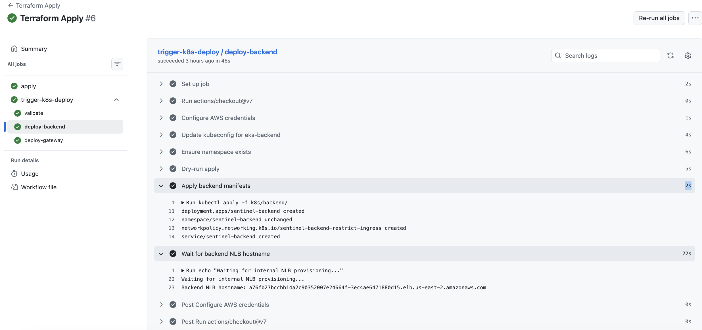
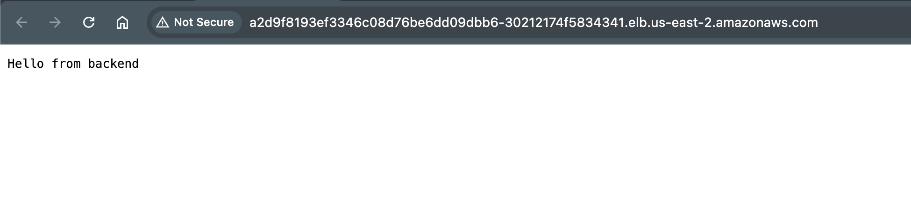

# Sentinel Split Architecture

PoC for Rapyd Sentinel's gateway/backend split: two VPCs, two EKS clusters,
private cross-VPC networking, and a proxy-to-backend request path — built
with modular Terraform and deployed via GitHub Actions.

## Architecture



vpc-gateway runs eks-gateway with an nginx reverse proxy behind a **public**
NLB — that's the only thing in this whole setup that's reachable from the
internet. vpc-backend runs eks-backend with a plain HTTP app behind an
**internal** NLB, only reachable through the peering link. Every node in
both clusters sits in a private subnet with no public IP.

## Repo structure

```
infra/
  bootstrap/          tfstate S3 bucket (applied once, locally)
  modules/
    vpc/               VPC, subnets, NAT, routing
    iam-eks/           eks-<name>-cluster-role / eks-<name>-node-role
    eks/               cluster + node group + core add-ons
    peering/           VPC peering + routes
    security-groups/   cross-VPC ingress restriction
  envs/poc/            wires the modules together
k8s/
  backend/             namespace, deployment, internal service, NetworkPolicy
  gateway/             namespace, configmap template, deployment, public service, nginx config
.github/workflows/
  terraform-plan.yml
  terraform-apply.yml
  k8s-deploy.yml
```

## IAM naming

Every role created here matches `eks-*` or `sentinel-*`:
`eks-gateway-cluster-role`, `eks-gateway-node-role`,
`eks-backend-cluster-role`, `eks-backend-node-role`.

The IAM user is also not granted `iam:TagRole`, only `iam:CreateRole` and
the policy-attachment actions, scoped to those role ARNs. AWS treats a
`CreateRole` call that carries tags as needing `TagRole` too — same API
call, both permissions checked — so these two roles are provisioned
through a separate, untagged AWS provider alias (see `providers.tf`)
instead of inheriting the account-wide `default_tags`. Everything else
(VPC, subnets, EKS clusters, security groups) still gets tagged normally.

## Security model

- Security group on backend nodes: only accepts traffic from the gateway
  VPC's CIDR, on the app port and the NodePort range.
- Kubernetes NetworkPolicy on the backend namespace: only accepts traffic
  from pods labeled `role: trusted-client`.
- Backend service is internal-only (no public IP); gateway service is the
  one public entry point.

## CI/CD

Three GitHub Actions workflows, authenticated with static AWS access keys
(see below for why, not OIDC) as repo secrets:

- **terraform-plan.yml** — runs on every PR: fmt check, validate, tflint,
  plan.
- **terraform-apply.yml** — runs on merge to `main`: applies the
  infrastructure, then triggers `k8s-deploy.yml`.
- **k8s-deploy.yml** — validates manifests with kubeconform, dry-run
  applies, then deploys backend first, waits for its internal NLB
  hostname, renders the gateway's nginx config with that hostname, and
  deploys the gateway.

OIDC federation was the first approach, but the provided IAM user isn't
authorized for `iam:CreateOpenIDConnectProvider` or `iam:CreatePolicy` —
both account-level actions outside the `eks-*`/`sentinel-*` role scope, so
they're not something a Terraform apply under this IAM user can create
regardless of naming. Static keys are the working alternative available
under the current permission boundary.

#### Sample Screenshots









## Verifying it works



## Cost


Estimated from the AWS Pricing Calculator, us-east-2.

| Component | Calculation | Monthly |
|---|---|---|
| EC2 nodes (t3.medium, on-demand) | 4 nodes (2 per cluster) x $0.0416/hr x 730 hrs | $121.48 |
| Data transfer (cross-AZ, peering, egress) | usage-dependent | Depending on the usage |
| **Subtotal (fixed, compute-only)** | | **$121.48** |


NAT Gateway, NLB, and data transfer are still being pulled from the
calculator. Nodes assume the default `desired_size = 2` per cluster set in
`infra/envs/poc/variables.tf` — reduce to 1 per cluster for a cheaper PoC
run if you don't need the extra capacity/HA during review.

Tear down between review sessions with `terraform destroy` — none of this
needs to run continuously.

## Trade-offs

- Single NAT Gateway per VPC, not one per AZ (cost).
- EKS API endpoint is public but CIDR-restricted, since GitHub-hosted
  runners don't have a fixed IP to peer from.
- In-tree load balancer annotations instead of the AWS Load Balancer
  Controller, to avoid an extra controller install under time pressure.
- Default `vpc-cni` doesn't enforce NetworkPolicy out of the box; the SG
  rule is the actual enforcement layer right now.
- `terraform-plan.yml` and `terraform-apply.yml` originally both triggered
  on push to `main`, which raced for the same S3 state lock on every
  merge. Fixed by scoping plan to `pull_request` only, plus a shared
  `concurrency` group on both workflows as a second line of defense.
- No TLS yet, anywhere.

## Next steps

TLS/mTLS between gateway and backend, an ingress controller, GitOps
(Argo CD/Flux), observability (Prometheus/Grafana/OTel), Vault or External
Secrets Operator, Transit Gateway if a third VPC gets added, and
finer-grained per-addon IRSA roles if the naming guardrail is extended.
